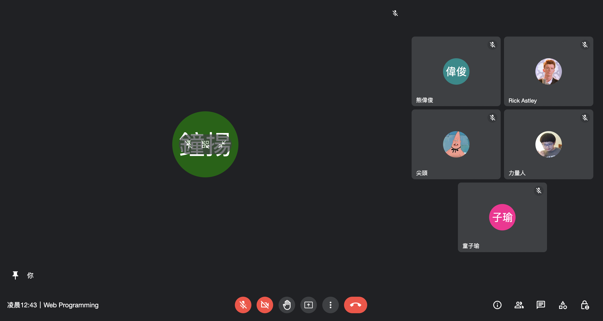
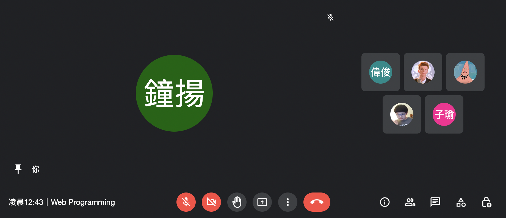
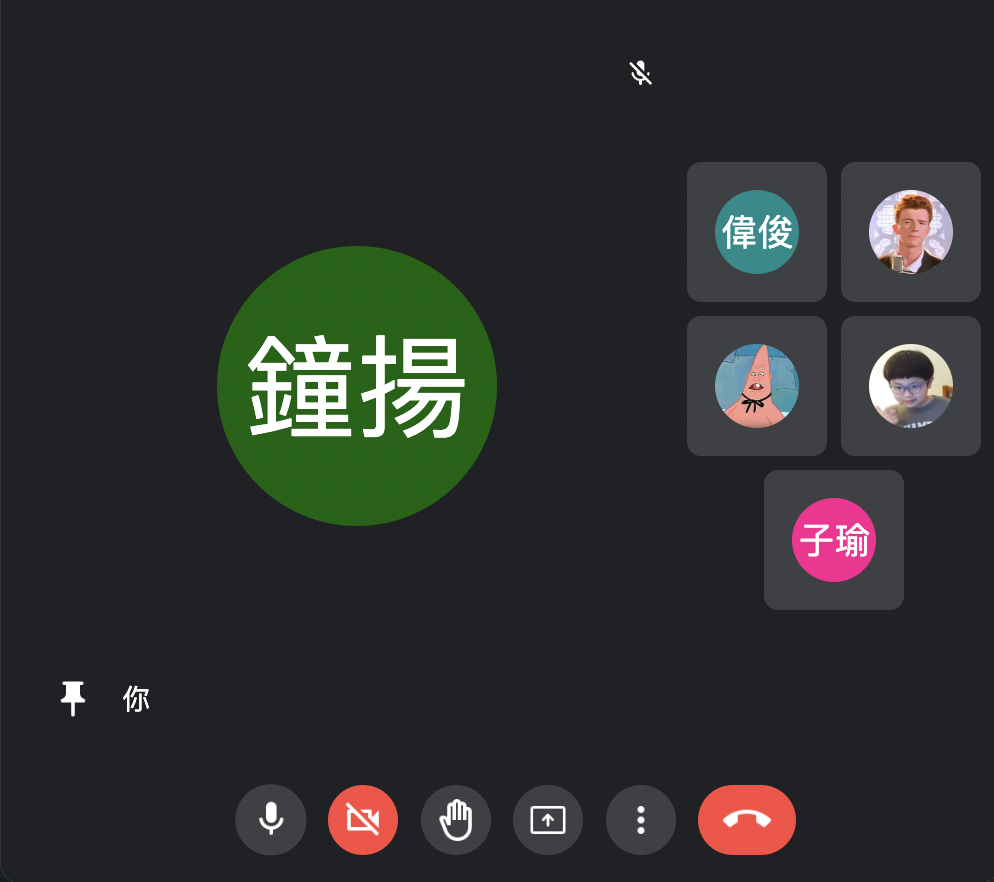

# Web Programming HW#1

> #### 建議使用 Chrome 或 Safari 瀏覽（沒試過其他的瀏覽器）

## 基本要求
- 全部達成

## 進階要求
- 全部達成

## 其他
- 所有基本／進階要求中的效果皆有使用 transition 使變化看起來更為流暢。
- 當（高度 < 500px）or（寬度 < 700px）時，右側的會議參與者會變為僅顯示大頭照的簡易模式。
- 為了避免畫面過於擁擠，當（寬度 < 800px）時，下方列左方的資訊欄會消失；（寬度 < 600px）時，右方的功能按鈕會消失。

## 範例截圖
#### 正常模式

#### 簡易模式：高度不足時

#### 簡易模式：寬度不足時
