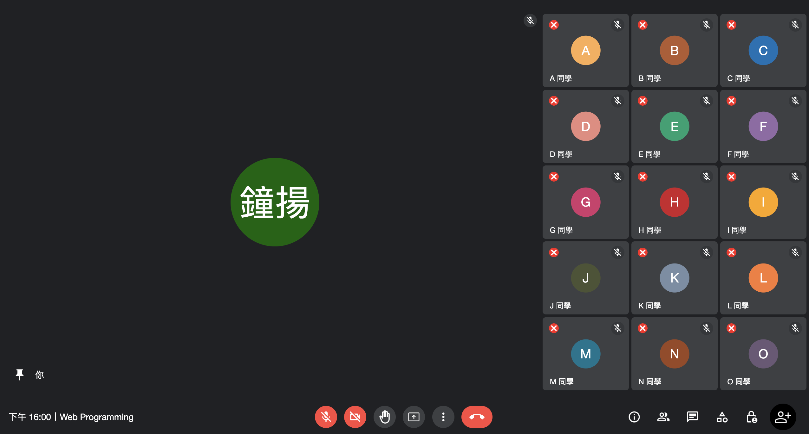
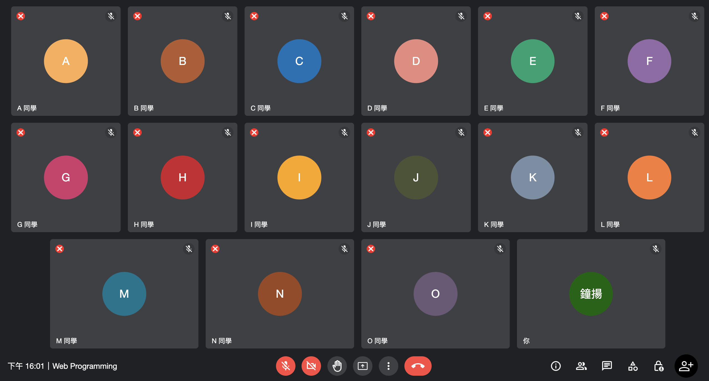

# Web Programming HW#2
> 作業中使用了 `aspect-ratio` 屬性，請確保你的瀏覽器版本在此之上：
>> Edge 88, Firefox 89, Safari 15, Chrome 88, Opera 74

## 基本要求
> **全部達成**

- 在側邊欄的每個與會者的小視窗左上方加上 (X) 符號。點選這個符號時，會將該與會者移除會議，並將其他與會者的小視窗重新排列好。自己的視窗不會有此符號。
- 當滑鼠游標進入 (hover) 某個與會者的小視窗時，中間的圓會浮現出三個額外的功能按鈕，並以一個半透明的橢圓形包覆起來，而當游標進入此橢圓時，則此橢圓形的透明度會降低 (顏色變深)。然後，如果點選此橢圓 (不一定要點選在圖釘上)，則此與會者將會取代目前的主視窗，而目前主視窗的與會者會加到旁邊的側邊欄。
- 當游標點擊主視窗使用者頭像上的橢圓時 (不一定要點選在圖釘上)，則關閉主視窗，且原先主視窗上的與會者會加入其他的與會者，一起重新排在整個視窗上。
- 如果目前沒有人被釘選 (anchored) 在主視窗上，則點擊某一位與會者頭像上的橢圓，則會出現主視窗，且此與會者會被釘選在主視窗上，而其他與會者則排列在側邊欄。
- 如果踢出所有的與會者，只剩下自己，則自己會佔滿整個視窗。

## 進階要求
> **全部達成**

- 一開始使用者個數介於 [1, 15] 之間的任意整數。
- 不管是側邊欄還是整個視窗，在排列與會者的小視窗時，考慮到小視窗長寬比例的動態調整，並且當最下面一排的小視窗個數較少時，適當的加長其寬度，讓畫面好看一些。
- 在右下角有一個 (+) 按鈕，當滑鼠點擊它時，可以新增一個與會者視窗。
- 左下角的時間顯示目前正確的時間，且會自動更新。

## 範例截圖

