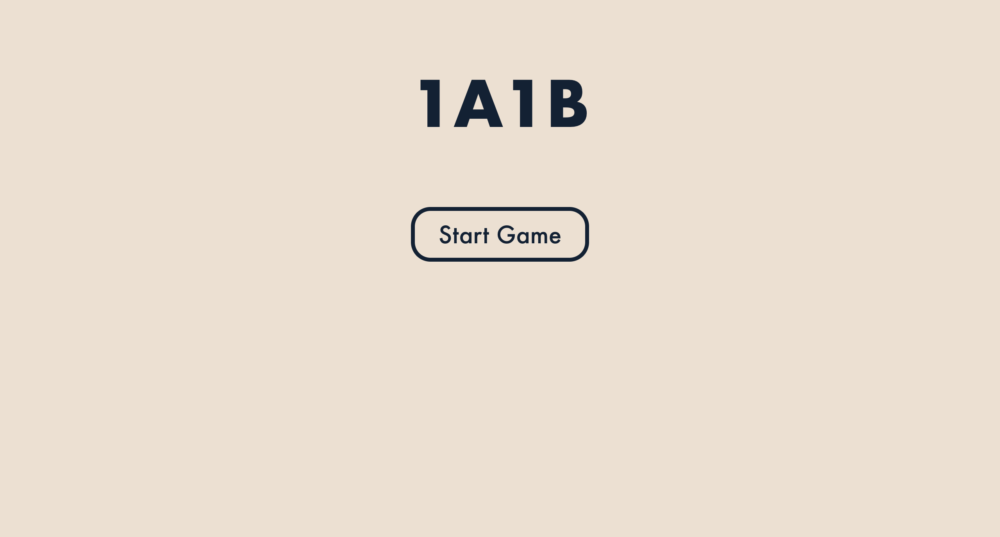
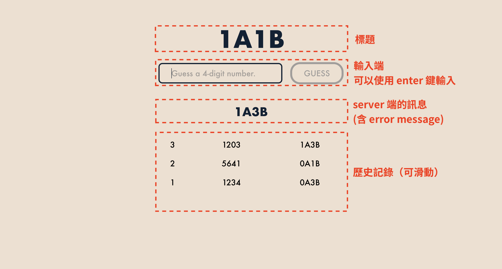
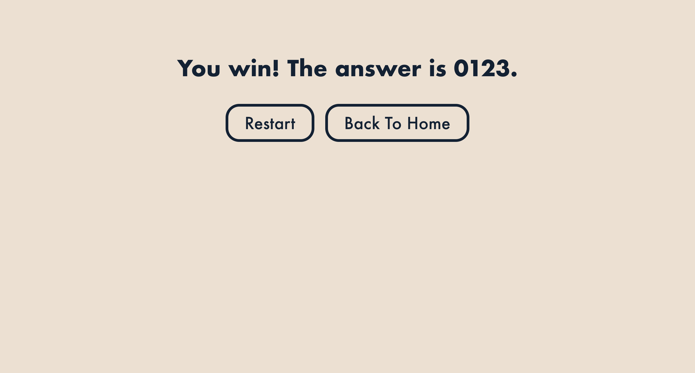

# Web Programming HW#5

## 基本要求及進階要求全部達成
> **小提醒：**
> 為了批改方便，可以將 `backend/core/getnumber.js` 中的第 13 行（`shuffle(randomNumber);`）註解掉，這樣答案就不會亂數生成（答案：0123）。

## 簡介
因應進階要求，此遊戲已經改成一個 1A1B 遊戲。玩家必須在 10 回合內猜出 server 端的四位數數字。輸入可以是任意長度為 4 的字串（含英文字，但答案中只有 0 ~ 9 的數字），答案中的數字不會重複。

## UI/UX 介紹

### 首頁

### 遊戲畫面

### 勝利／失敗畫面
> 失敗畫面會顯示 `You lose. The answer is ${number}.`

